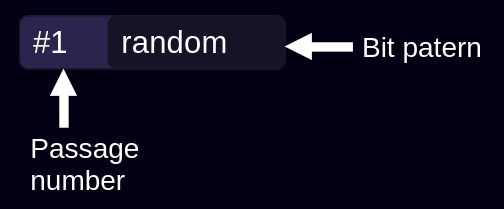
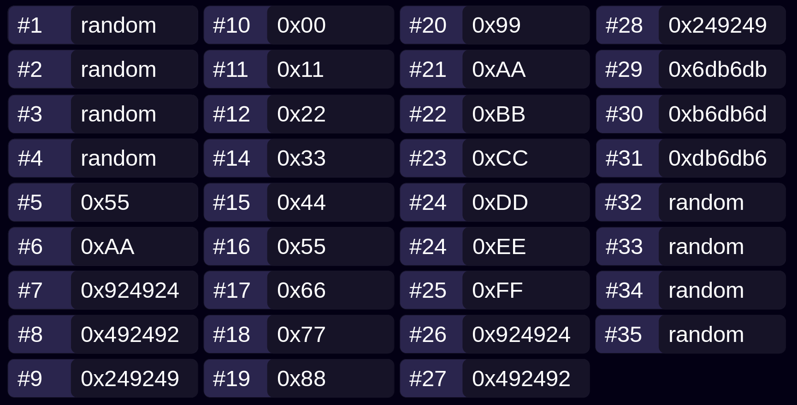

# Nozomi

A Rust library that wipe all file or folder. \
This library includes most of the secure deletion methods of the [Eraser](https://eraser.heidi.ie) for Windows software.

# Add to your project
```toml
[dependencies]
nozomi = "1.0.2"
```

## Test libraries
```shell
git clone https://github.com/Sans-Atout/Nozomi.git
cd Nozomi
chmod +x test.sh
./test.sh
```

## Code example
### Erase one file with Pseudo Random method
```rust
use nozomi;
use nozomi::enums::erase_method::EraserEntity;

fn main() {
    match nozomi::erase_file("path_to_file", EraserEntity::PseudoRandom){
        Ok(info) => println!("{}",info),
        Err(error) => println!("{}",error)
    };
}
```

### Erase one folder with Pseudo Random method
```rust
use nozomi;
use nozomi::enums::erase_method::EraserEntity;

fn main() {
    match nozomi::erase_folder("path_to_folder", EraserEntity::PseudoRandom){
        Ok(info) => println!("{}",info),
        Err(error) => println!("{}",error)
    };
}
```
# [Changelog](CHANGELOG.md)

# Erase Method
Here are all the methods available and an illustrative diagram for each suppression method.

You can see below an explanation of one brick of the scheme :


## [Pseudo Random](https://www.lifewire.com/data-sanitization-methods-2626133#toc-random-data)


## [Gutmann](https://en.wikipedia.org/wiki/Gutmann_method)



## [Hmgi S5](https://www.bitraser.com/knowledge-series/data-destruction-standards-and-guidelines.php)


## [DOD 522022 MECE](https://www.bitraser.com/article/DoD-5220-22-m-standard-for-drive-erasure.php)


## [DOD 522022 ME](https://www.bitraser.com/article/DoD-5220-22-m-standard-for-drive-erasure.php)


## [AFSSI 5020](https://www.lifewire.com/data-sanitization-methods-2626133#toc-afssi-5020)


## [RCMP TSSIT OPS II](https://www.datadestroyers.eu/technology/rcmp_tssit_ops-2.html)
